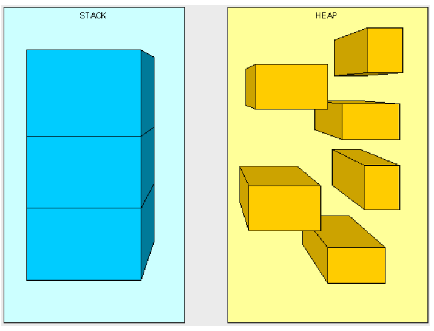
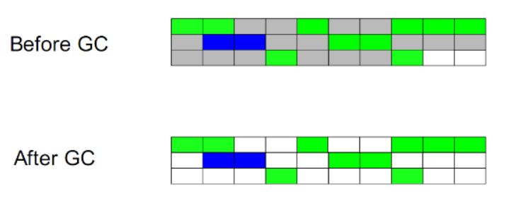
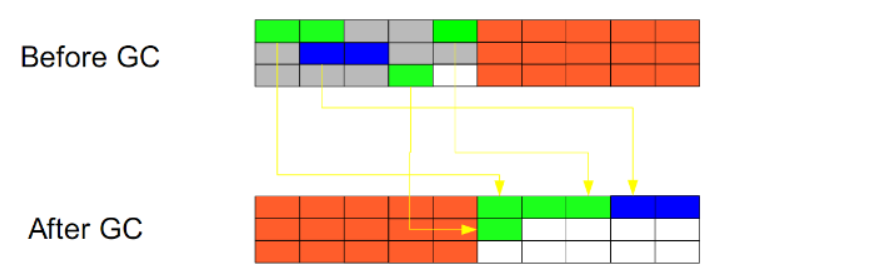
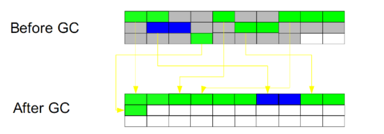

# JVM调优

转载自：[JVM调优总结 - Andrew.Zhou - 博客园 (cnblogs.com)](https://www.cnblogs.com/andy-zhou/p/5327288.html)

## 1. 堆与栈

### 1.1 JVM虚拟机组成

<font color='red'>`运行时数据区`、`类装载子系统`、`字节码执行引擎`</font>
其中`运行时数据区`包含：堆、栈、本地方法栈、元空间、程序计数器

### 1.2 堆与栈



### 1.3 栈是运行时的单位，而堆是存储的单位。

栈解决程序的运行问题，即程序如何执行，或者说如何处理数据；堆解决的是数据存储的问题，即数据怎么放、放在哪儿。

在Java中一个线程就会相应有一个线程栈与之对应，这点很容易理解，因为不同的线程执行逻辑有所不同，因此需要一个独立的线程栈。而堆则是所有线程共享的。栈因为是运行单位，因此里面存储的信息都是跟当前线程（或程序）相关信息的。包括局部变量、程序运行状态、方法返回值等等；而堆只负责存储对象信息。

### 1.4 为什么要把堆和栈区分出来呢？栈中不是也可以存储数据吗？

第一，从软件设计的角度看，<font color='red'>**栈代表了处理逻辑，而堆代表了数据**</font>。这样分开，使得处理逻辑更为清晰。分而治之的思想。这种隔离、模块化的思想在软件设计的方方面面都有体现。

第二，堆与栈的分离，使得<font color='red'>**堆中的内容可以被多个栈共享（也可以理解为多个线程访问同一个对象）**</font>。这种共享的收益是很多的。一方面这种共享提供了一种有效的数据交互方式(如：共享内存)，另一方面，堆中的共享常量和缓存可以被所有栈访问，节省了空间。

第三，栈因为运行时的需要，比如保存系统运行的上下文，需要进行地址段的划分。由于<font color='red'>**栈只能向上增长**</font>，因此就会限制住栈存储内容的能力。而堆不同，堆中的对象是可以<font color='red'>**根据需要动态增长**</font>的，因此栈和堆的拆分，使得动态增长成为可能，相应栈中只需记录堆中的一个地址即可。

第四，<font color='red'>**面向对象就是堆和栈的完美结合**</font>。其实，面向对象方式的程序与以前结构化的程序在执行上没有任何区别。但是，面向对象的引入，使得对待问题的思考方式发生了改变，而更接近于自然方式的思考。当我们把对象拆开，你会发现，<font color='red'>**对象的属性其实就是数据，存放在堆中；而对象的行为（方法），就是运行逻辑，放在栈中**</font>。我们在编写对象的时候，其实即编写了数据结构，也编写的处理数据的逻辑。不得不承认，面向对象的设计，确实很美。

### 1.5 堆与栈存放的是什么？

堆中存放的是对象数据，栈中存放基础数据类型及对象的引用。

堆中的对象大小不可估计，可以动态变化；栈中的对象引用只会占用4byte

为什么不把基本类型放堆中呢？因为其占用的空间一般是1~8个字节——需要空间比较少，而且因为是基本类型，所以不会出现动态增长的情况——长度固定，因此栈中存储就够了，如果把他存在堆中是没有什么意义的（还会浪费空间，后面说明）。可以这么说，基本类型和对象的引用都是存放在栈中，而且都是几个字节的一个数，因此在程序运行时，他们的处理方式是统一的。但是基本类型、对象引用和对象本身就有所区别了，因为一个是栈中的数据一个是堆中的数据。最常见的一个问题就是，Java中参数传递时的问题。

### 1.6 Java对象的大小

基础数据类型大小固定，空Object对象的大小是8byte。

因为所有的Java非基本类型的对象都需要默认继承Object对象，因此不论什么样的Java对象，其大小都必须是大于8byte

所以 一个Java对象占用空间至少是 **4byte(引用地址)+8byte(Object大小)**

```Java
public class Module {
	private int num;
	private boolean flag;
	private Object obj;
}
其大小为：空对象大小(8byte)+int大小(4byte)+Boolean大小(1byte)+空Object引用的大小(4byte)=17byte。但是因为Java在对对象内存分配时都是以8的整数倍来分，因此大于17byte的最接近8的整数倍的是24，因此此对象的大小为24byte。
```

这里需要注意一下基本类型的包装类型的大小。因为这种包装类型已经成为对象了，因此需要把他们作为对象来看待。包装类型的大小至少是12byte（声明一个空Object至少需要的空间），而且12byte没有包含任何有效信息，同时，因为Java对象大小是8的整数倍，因此一个基本类型包装类的大小至少是16byte。这个内存占用是很恐怖的，它是使用基本类型的N倍（N>2），有些类型的内存占用更是夸张（随便想下就知道了）。因此，可能的话应尽量少使用包装类。在JDK5.0以后，因为加入了自动类型装换，因此，Java虚拟机会在存储方面进行相应的优化。

### 1.7 引用类型

对象引用类型分为`强引用`、`软引用`、`弱引用`和`虚引用`。

**强引用**:就是我们一般声明对象是时虚拟机生成的引用，强引用环境下，垃圾回收时需要严格判断当前对象是否被强引用，如果被强引用，则不会被垃圾回收

**软引用**:软引用一般被做为缓存来使用。与强引用的区别是，软引用在垃圾回收时，虚拟机会根据当前系统的剩余内存来决定是否对软引用进行回收。**如果剩余内存比较紧张，则虚拟机会回收软引用所引用的空间；如果剩余内存相对富裕，则不会进行回收**。换句话说，虚拟机在发生OutOfMemory时，肯定是没有软引用存在的。

**弱引用**:弱引用与软引用类似，都是作为缓存来使用。但与软引用不同，**弱引用在进行垃圾回收时，是一定会被回收掉的**，因此其生命周期只存在于一个垃圾回收周期内。

强引用不用说，我们系统一般在使用时都是用的强引用。而“软引用”和“弱引用”比较少见。他们一般被作为缓存使用，而且一般是在内存大小比较受限的情况下做为缓存。因为如果内存足够大的话，可以直接使用强引用作为缓存即可，同时可控性更高。因而，他们常见的是被使用在桌面应用系统的缓存。

## 2. 垃圾回收算法

可以从不同的的角度去划分垃圾回收算法

### 2.1 按照基本回收策略分

分为`引用计数`、`标记-清除`、`复制`、`标记-整理`


#### 2.1.1 引用计数（Reference Counting）

古老的垃圾回收算法，对象有一个引用则计数+1，删除一个引用则计数-1，垃圾回收的时候只会收集计数为0的对象。

**无法处理循环引用的问题**


#### 2.1.2 标记-清除（Mark-Sweep）



此算法执行分两阶段。第一阶段从引用根节点开始标记所有被引用的对象，第二阶段遍历整个堆，把未标记的对象清除。**此算法需要暂停整个应用，同时，会产生内存碎片。**


#### 2.1.3 复制（Copying）



此算法把正在使用的对象copy到另一块内存区域中，同时进行内存整理，不会出现内存碎片。因为是复制的使用中对象，所以复制成本较小。缺点是**需要两倍的内存空间**


#### 2.1.4 标记-整理（Mark-Compact）



此算法结合了<a href="#2.1.2 标记-清除（Mark-Sweep）">标记-清除</a>和<a href="#2.1.3 复制（Copying）">复制</a>两个算法的优点。也是分两阶段，第一阶段从根节点开始标记所有被引用对象，第二阶段遍历整个堆，把清除未标记对象并且把存活对象“压缩”到堆的其中一块，按顺序排放。此算法避免了“标记-清除”的碎片问题，同时也避免了“复制”算法的空间问题。

