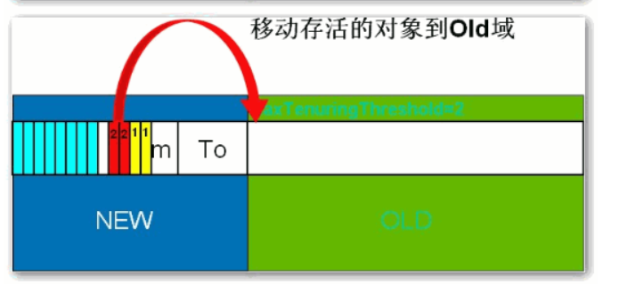
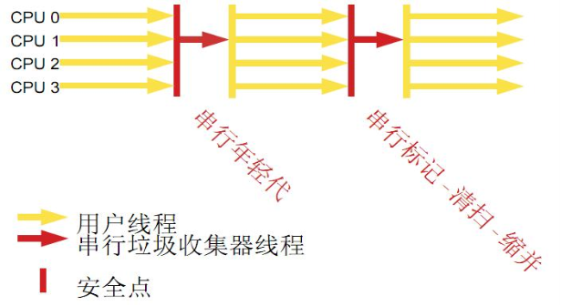

# JVM调优

转载自：[JVM调优总结 - Andrew.Zhou - 博客园 (cnblogs.com)](https://www.cnblogs.com/andy-zhou/p/5327288.html)

## 1. 堆与栈

### 1.1 JVM虚拟机组成

<font color='red'>`运行时数据区`、`类装载子系统`、`字节码执行引擎`</font>
其中`运行时数据区`包含：堆、栈、本地方法栈、元空间、程序计数器

### 1.2 堆与栈


### 1.3 栈是运行时的单位，而堆是存储的单位。

栈解决程序的运行问题，即程序如何执行，或者说如何处理数据；堆解决的是数据存储的问题，即数据怎么放、放在哪儿。

在Java中一个线程就会相应有一个线程栈与之对应，这点很容易理解，因为不同的线程执行逻辑有所不同，因此需要一个独立的线程栈。而堆则是所有线程共享的。栈因为是运行单位，因此里面存储的信息都是跟当前线程（或程序）相关信息的。包括局部变量、程序运行状态、方法返回值等等；而堆只负责存储对象信息。

### 1.4 为什么要把堆和栈区分出来呢？栈中不是也可以存储数据吗？

第一，从软件设计的角度看，<font color='red'>**栈代表了处理逻辑，而堆代表了数据**</font>。这样分开，使得处理逻辑更为清晰。分而治之的思想。这种隔离、模块化的思想在软件设计的方方面面都有体现。

第二，堆与栈的分离，使得<font color='red'>**堆中的内容可以被多个栈共享（也可以理解为多个线程访问同一个对象）**</font>。这种共享的收益是很多的。一方面这种共享提供了一种有效的数据交互方式(如：共享内存)，另一方面，堆中的共享常量和缓存可以被所有栈访问，节省了空间。

第三，栈因为运行时的需要，比如保存系统运行的上下文，需要进行地址段的划分。由于<font color='red'>**栈只能向上增长**</font>，因此就会限制住栈存储内容的能力。而堆不同，堆中的对象是可以<font color='red'>**根据需要动态增长**</font>的，因此栈和堆的拆分，使得动态增长成为可能，相应栈中只需记录堆中的一个地址即可。

第四，<font color='red'>**面向对象就是堆和栈的完美结合**</font>。其实，面向对象方式的程序与以前结构化的程序在执行上没有任何区别。但是，面向对象的引入，使得对待问题的思考方式发生了改变，而更接近于自然方式的思考。当我们把对象拆开，你会发现，<font color='red'>**对象的属性其实就是数据，存放在堆中；而对象的行为（方法），就是运行逻辑，放在栈中**</font>。我们在编写对象的时候，其实即编写了数据结构，也编写的处理数据的逻辑。不得不承认，面向对象的设计，确实很美。

### 1.5 堆与栈存放的是什么？

堆中存放的是对象数据，栈中存放基础数据类型及对象的引用。

堆中的对象大小不可估计，可以动态变化；栈中的对象引用只会占用4byte

为什么不把基本类型放堆中呢？因为其占用的空间一般是1~8个字节——需要空间比较少，而且因为是基本类型，所以不会出现动态增长的情况——长度固定，因此栈中存储就够了，如果把他存在堆中是没有什么意义的（还会浪费空间，后面说明）。可以这么说，基本类型和对象的引用都是存放在栈中，而且都是几个字节的一个数，因此在程序运行时，他们的处理方式是统一的。但是基本类型、对象引用和对象本身就有所区别了，因为一个是栈中的数据一个是堆中的数据。最常见的一个问题就是，Java中参数传递时的问题。

### 1.6 Java对象的大小

基础数据类型大小固定，空Object对象的大小是8byte。

因为所有的Java非基本类型的对象都需要默认继承Object对象，因此不论什么样的Java对象，其大小都必须是大于8byte

所以 一个Java对象占用空间至少是 **4byte(引用地址)+8byte(Object大小)**

```Java
public class Module {
	private int num;
	private boolean flag;
	private Object obj;
}
其大小为：空对象大小(8byte)+int大小(4byte)+Boolean大小(1byte)+空Object引用的大小(4byte)=17byte。但是因为Java在对对象内存分配时都是以8的整数倍来分，因此大于17byte的最接近8的整数倍的是24，因此此对象的大小为24byte。
```

这里需要注意一下基本类型的包装类型的大小。因为这种包装类型已经成为对象了，因此需要把他们作为对象来看待。包装类型的大小至少是12byte（声明一个空Object至少需要的空间），而且12byte没有包含任何有效信息，同时，因为Java对象大小是8的整数倍，因此一个基本类型包装类的大小至少是16byte。这个内存占用是很恐怖的，它是使用基本类型的N倍（N>2），有些类型的内存占用更是夸张（随便想下就知道了）。因此，可能的话应尽量少使用包装类。在JDK5.0以后，因为加入了自动类型装换，因此，Java虚拟机会在存储方面进行相应的优化。

### 1.7 引用类型

对象引用类型分为`强引用`、`软引用`、`弱引用`和`虚引用`。

**强引用**:就是我们一般声明对象是时虚拟机生成的引用，强引用环境下，垃圾回收时需要严格判断当前对象是否被强引用，如果被强引用，则不会被垃圾回收

**软引用**:软引用一般被做为缓存来使用。与强引用的区别是，软引用在垃圾回收时，虚拟机会根据当前系统的剩余内存来决定是否对软引用进行回收。**如果剩余内存比较紧张，则虚拟机会回收软引用所引用的空间；如果剩余内存相对富裕，则不会进行回收**。换句话说，虚拟机在发生OutOfMemory时，肯定是没有软引用存在的。

**弱引用**:弱引用与软引用类似，都是作为缓存来使用。但与软引用不同，**弱引用在进行垃圾回收时，是一定会被回收掉的**，因此其生命周期只存在于一个垃圾回收周期内。

强引用不用说，我们系统一般在使用时都是用的强引用。而“软引用”和“弱引用”比较少见。他们一般被作为缓存使用，而且一般是在内存大小比较受限的情况下做为缓存。因为如果内存足够大的话，可以直接使用强引用作为缓存即可，同时可控性更高。因而，他们常见的是被使用在桌面应用系统的缓存。

## 2. 垃圾回收算法

可以从不同的的角度去划分垃圾回收算法

### 2.1 按照基本回收策略分

分为`引用计数`、`标记-清除`、`复制`、`标记-整理`


#### 2.1.1 引用计数（Reference Counting）

古老的垃圾回收算法，对象有一个引用则计数+1，删除一个引用则计数-1，垃圾回收的时候只会收集计数为0的对象。

**无法处理循环引用的问题**


#### 2.1.2 标记-清除（Mark-Sweep）


此算法执行分两阶段。第一阶段从引用根节点开始标记所有被引用的对象，第二阶段遍历整个堆，把未标记的对象清除。**此算法需要暂停整个应用，同时，会产生内存碎片。**


#### 2.1.3 复制（Copying）


此算法把正在使用的对象copy到另一块内存区域中，同时进行内存整理，不会出现内存碎片。因为是复制的使用中对象，所以复制成本较小。缺点是**需要两倍的内存空间**


#### 2.1.4 标记-整理（Mark-Compact）


此算法结合了<a href="#2.1.2 标记-清除（Mark-Sweep）">标记-清除</a>和<a href="#2.1.3 复制（Copying）">复制</a>两个算法的优点。也是分两阶段，第一阶段从根节点开始标记所有被引用对象，第二阶段遍历整个堆，把清除未标记对象并且把存活对象“压缩”到堆的其中一块，按顺序排放。此算法避免了“标记-清除”的碎片问题，同时也避免了“复制”算法的空间问题。

### 2.2 按照分区对待的方式分

#### 2.2.1 增量收集

实时垃圾回收算法，即：在应用进行的同时进行垃圾回收。不知道什么原因JDK5.0中的收集器没有使用这种算法的

#### 2.2.2 分代收集

基于对对象生命周期分析后得出的垃圾回收算法。把对象分为年青代、年老代、持久代，对不同生命周期的对象使用不同的算法（上述方式中的一个）进行回收。现在的垃圾回收器（从J2SE1.2开始）都是使用此算法的。

### 2.3 按照系统分

#### 2.3.1 串行收集

串行收集使用单线程处理所有垃圾回收工作, 因为无需多线程交互，实现容易，而且效率比较高。但是，其局限性也比较明显，即无法使用多处理器的优势，所以此收集适合单处理器机器。当然，此收集器也可以用在小数据量（100M左右）情况下的多处理器机器上。

#### 2.3.2 并行收集

并行收集使用多线程处理垃圾回收工作，因而速度快，效率高。而且理论上CPU数目越多，越能体现出并行收集器的优势。

#### 2.3.3 并发收集

相对于串行收集和并行收集而言，前面两个在进行垃圾回收工作时，**需要暂停整个运行环境**，而只有垃圾回收程序在运行，因此，系统在垃圾回收时会有明显的暂停，而且暂停时间会因为堆越大而越长。


## 3. 如何区分垃圾

上面说到的“引用计数”法，通过统计控制生成对象和删除对象时的引用数来判断。垃圾回收程序收集计数为0的对象即可。但是这种方法无法解决循环引用。所以，后来实现的垃圾判断算法中，都是从程序运行的根节点出发，遍历整个对象引用，查找存活的对象。那么在这种方式的实现中，垃圾回收从哪儿开始的呢？即，从哪儿开始查找哪些对象是正在被当前系统使用的。上面分析的堆和栈的区别，其中栈是真正进行程序执行地方，所以要获取哪些对象正在被使用，则需要**从Java栈开始**。同时，一个栈是与一个线程对应的，因此，如果有多个线程的话，则必须对这些线程对应的所有的栈进行检查。


同时，除了栈外，还有系统运行时的**寄存器**等，**也是存储程序运行数据的**。这样，**以栈或寄存器中的引用为起点**，我们可以找到堆中的对象，又从这些对象找到对堆中其他对象的引用，这种引用逐步扩展，**最终以null引用或者基本类型结束**，这样就形成了一颗以Java栈中引用所对应的对象为根节点的一颗对象树，如果栈中有多个引用，则最终会形成多颗对象树。在这些对象树上的对象，都是当前系统运行所需要的对象，不能被垃圾回收。而其他剩余对象，则可以视为无法被引用到的对象，可以被当做垃圾进行回收。

因此，**垃圾回收的起点是一些根对象（java栈, 静态变量, 寄存器...）**。而最简单的Java栈就是Java程序执行的main函数。这种回收方式，也是上面提到的“标记-清除”的回收方式。

## 4. 如何处理碎片

由于不同Java对象存活时间是不一定的，因此，在程序运行一段时间以后，如果不进行内存整理，就会出现零散的内存碎片。碎片最直接的问题就是会导致无法分配大块的内存空间，以及程序运行效率降低。所以，在上面提到的基本垃圾回收算法中，**复制**方式和**标记-整理**方式，都可以解决碎片的问题。

## 5. 如何解决同时存在的对象创建和对象回收问题

垃圾回收线程是回收内存的，而程序运行线程则是消耗（或分配）内存的，一个回收内存，一个分配内存，从这点看，两者是矛盾的。因此，在现有的垃圾回收方式中，**要进行垃圾回收前，一般都需要暂停整个应用**（即：暂停内存的分配），然后进行垃圾回收，回收完成后再继续应用。这种实现方式是最直接，而且最有效的解决二者矛盾的方式。

但是这种方式有一个很明显的弊端，就是当堆空间持续增大时，垃圾回收的时间也将会相应的持续增大，对应应用暂停的时间也会相应的增大。一些对相应时间要求很高的应用，比如最大暂停时间要求是几百毫秒，那么当堆空间大于几个G时，就很有可能超过这个限制，在这种情况下，垃圾回收将会成为系统运行的一个瓶颈。为解决这种矛盾，有了并发垃圾回收算法，使用这种算法，垃圾回收线程与程序运行线程同时运行。在这种方式下，解决了暂停的问题，但是因为需要在新生成对象的同时又要回收对象，算法复杂性会大大增加，系统的处理能力也会相应降低，同时，“碎片”问题将会比较难解决。

## 6. 为什么要分代

分代的垃圾回收策略，是基于这样一个事实：**不同的对象的生命周期是不一样的**。因此，不同生命周期的对象可以采取不同的收集方式，以便提高回收效率。

在Java程序运行的过程中，会产生大量的对象，其中有些对象是与业务信息相关，比如Http请求中的Session对象、线程、Socket连接，这类对象跟业务直接挂钩，因此生命周期比较长。但是还有一些对象，主要是程序运行过程中生成的临时变量，这些对象生命周期会比较短，比如：String对象，由于其不变类的特性，系统会产生大量的这些对象，有些对象甚至只用一次即可回收。

试想，在不进行对象存活时间区分的情况下，每次垃圾回收都是对整个堆空间进行回收，花费时间相对会长，同时，因为每次回收都需要遍历所有存活对象，但实际上，对于生命周期长的对象而言，这种遍历是没有效果的，因为可能进行了很多次遍历，但是他们依旧存在。因此，分代垃圾回收采用分治的思想，进行代的划分，把不同生命周期的对象放在不同代上，不同代上采用最适合它的垃圾回收方式进行回收。

## 7. 如何分代


如图所示：

虚拟机中的共划分为三个代**：年轻代（Young Generation）**、**年老代（Old Generation）**和**持久代（Permanent Generation）**。其中持久代主要存放的是Java类的类信息，与垃圾收集要收集的Java对象关系不大。年轻代和年老代的划分是对垃圾收集影响比较大的。

#### 年轻代

所有新生成的对象首先都是放在年轻代的。年轻代的目标就是尽可能快速的收集掉那些生命周期短的对象。年轻代分三个区。一个Eden区，两个Survivor区(一般而言)。大部分对象在Eden区中生成。当Eden区满时，还存活的对象将被复制到Survivor区（两个中的一个），当这个Survivor区满时，此区的存活对象将被复制到另外一个Survivor区，当这个Survivor去也满了的时候，从第一个Survivor区复制过来的并且此时还存活的对象，将被复制“年老区(Tenured)”。需要注意，Survivor的两个区是对称的，没先后关系，所以同一个区中可能同时存在从Eden复制过来 对象，和从前一个Survivor复制过来的对象，而复制到年老区的只有从第一个Survivor去过来的对象。而且，**Survivor区总有一个是空的**。同时，根据程序需要，Survivor区是可以配置为多个的（多于两个），这样可以增加对象在年轻代中的存在时间，减少被放到年老代的可能。

#### 年老代

在年轻代中经历了N次垃圾回收后仍然存活的对象，就会被放到年老代中。因此，可以认为年老代中存放的都是一些生命周期较长的对象。

#### 持久代

用于存放静态文件，如今Java类、方法等。持久代对垃圾回收没有显著影响，但是有些应用可能动态生成或者调用一些class，例如Hibernate等，在这种时候需要设置一个比较大的持久代空间来存放这些运行过程中新增的类。持久代大小通过-XX:MaxPermSize=进行设置。

## 8. 什么情况下触发垃圾回收

由于对象进行了分代处理，因此垃圾回收区域、时间也不一样。GC有两种类型：Scavenge GC和Full GC。

#### Scavenge GC

一般情况下，当新对象生成，并且在Eden申请空间失败时，就会触发Scavenge GC，对Eden区域进行GC，清除非存活对象，并且把尚且存活的对象移动到Survivor区。然后整理Survivor的两个区。这种方式的GC是对年轻代的Eden区进行，不会影响到年老代。因为大部分对象都是从Eden区开始的，同时Eden区不会分配的很大，所以Eden区的GC会频繁进行。因而，一般在这里需要使用速度快、效率高的算法，使Eden去能尽快空闲出来。

#### Full GC

对整个堆进行整理，包括Young、Tenured和Perm。**Full GC因为需要对整个堆进行回收**，所以比Scavenge GC要慢，因此应该尽可能减少Full GC的次数。在对JVM调优的过程中，很大一部分工作就是对于FullGC的调节。有如下原因可能导致Full GC：

```markdown
· 年老代（Tenured）被写满
· 持久代（Perm）被写满 
· System.gc()被显示调用 
· 上一次GC之后Heap的各域分配策略动态变化
```

## 9. 分代垃圾回收流程示意

年轻代分为Eden区，两个或以上的Survivor区

Survivor-To 存放标记存活的对象，对象可以来自Eden，也可以来自From区

Survivor-From 存放从To区过来的对象


当前是一个空白的年轻代和年老代


Eden区即将写满


新对象继续在Eden区创建，申请内存失败


执行Scavenge GC，标记存活的对象移动到Survivor-To区


1. 清理Eden区
2. 整理Survivor区，将To区的存活对象移动到From区


Eden区再次开始创建对象，此时Survivor-From区中已经存放上次GC后还存活的对象


Eden内存申请失败后，执行Scavenge GC，Eden区标记**存活的对象**移动到Survivor-To区，同时**将Survivor-From区的存活对象**也移动到Survivor-To区


此时Survivor-To区中存放的是 **本次Eden中存活的对象(第1轮GC存活对象) 标记为1和上一次Scavenge GC后，Survivor-From中存活的对象(第2轮GC存活对象)，标记为2**


然后执行GC ，整理Survivor区，将Survivor-To区中所有对象移动到Survivor-From中，Eden区则又开始分配内存创建对象

此时From区中存放的是 第一次GC和第二次GC过后还存活的对象


Eden再次分配内存，申请内存失败后，执行Scavenge GC，找到当前GC执行完毕且存活，**并且将存活轮次>1的对象**

**移动到年老代**




再将**第二次GC的存活对象(由标记1 升级为 标记2)及本次GC的存活对象(新的标记1)放入To区**


最后再次执行Eden区清理，同时整理Survivor区，将To区对象移动到From区

## 10. 选择合适的垃圾收集算法

### 串行收集器



用单线程处理所有垃圾回收工作，因为无需多线程交互，所以效率比较高。但是，也无法使用多处理器的优势，所以此收集器适合单处理器机器。当然，此收集器也可以用在小数据量（100M左右）情况下的多处理器机器上。可以使用-XX:+UseSerialGC打开。

### 并行收集器


对年轻代进行并行垃圾回收，因此可以减少垃圾回收时间。一般在多线程多处理器机器上使用。使用-XX:+UseParallelGC.打开。并行收集器在J2SE5.0第六更新上引入，在Java SE6.0中进行了增强--可以对年老代进行并行收集。**如果年老代不使用并发收集的话，默认是使用单线程进行垃圾回收，因此会制约扩展能力。**使用-XX:+UseParallelOldGC打开。

使用-XX:ParallelGCThreads=设置并行垃圾回收的线程数。此值可以设置与机器处理器数量相等。

此收集器可以进行如下配置：

> 最大垃圾回收暂停:指定垃圾回收时的最长暂停时间，通过-XX:MaxGCPauseMillis=<N><N>指定。
>
> <N>为毫秒.如果指定了此值的话，堆大小和垃圾回收相关参数会进行调整以达到指定值。**设定此值可能会减少应用的吞吐量**。
>
> 吞吐量:吞吐量为垃圾回收时间与非垃圾回收时间的比值，通过-XX:GCTimeRatio=<N>来设定，公式为1/（1+N）。例如，-**XX:GCTimeRatio=19时，表示5%的时间用于垃圾回收**。默认情况为99，即>1%的时间用于垃圾回收。

### 并发收集器

可以保证大部分工作都并发进行（应用不停止），垃圾回收只暂停很少的时间，此收集器适合对响应时间要求比较高的中、大规模应用。使用-XX:+UseConcMarkSweepGC打开。


**并发收集器主要减少年老代的暂停时间**，他在应用不停止的情况下使用独立的垃圾回收线程，跟踪可达对象。在每个年老代垃圾回收周期中，在收集初期并发收集器 会对整个应用进行简短的暂停，在收集中还会再暂停一次。第二次暂停会比第一次稍长，在此过程中多个线程同时进行垃圾回收工作。

并发收集器使用处理器换来短暂的停顿时间。**在一个N个处理器的系统上，并发收集部分使用K/N个可用处理器进行回收，一般情况下1<=K<=N/4**。

在只有一个处理器的主机上使用并发收集器，设置为incremental mode模式也可获得较短的停顿时间。

#### 浮动垃圾

由于在应用运行的同时进行垃圾回收，所以有些垃圾可能在垃圾回收进行完成时产生，这样就造成了“Floating Garbage”，这些垃圾需要在下次垃圾回收周期时才能回收掉。所以，**并发收集器一般需要20%的预留空间用于这些浮动垃圾**。

#### Concurrent Mode Failure

并发收集器在应用运行时进行收集，所以需要保证堆在垃圾回收的这段时间有足够的空间供程序使用，否则，垃圾回收还未完成，堆空间先满了。这种情况下将会发生“并发模式失败”，此时整个应用将会暂停，进行垃圾回收。

#### 启动并发收集器

因为并发收集在应用运行时进行收集，所以必须保证收集完成之前有足够的内存空间供程序使用，否则会出现“Concurrent Mode Failure”。通过设置-XX:CMSInitiatingOccupancyFraction=指定还有多少剩余堆时开始执行并发收集

## 11. 小结

串行处理器：

- 适用情况：数据量比较小（100M左右）；单处理器下并且对响应时间无要求的应用。
- 缺点：只能用于小型应用

并行处理器：

- 适用情况：“对吞吐量有高要求”，多CPU、对应用响应时间无要求的中、大型应用。举例：后台处理、科学计算。
- 缺点：垃圾收集过程中应用响应时间可能加长

并发处理器：

- 适用情况：“对响应时间有高要求”，多CPU、对应用响应时间有较高要求的中、大型应用。举例：Web服务器/应用服务器、电信交换、集成开发环境。

以下配置主要针对分代垃圾回收算法而言。

## 12. 堆大小设置

年轻代的设置很关键
JVM中最大堆大小有三方面限制：相关操作系统的数据模型（32-bt还是64-bit）限制；系统的可用虚拟内存限制；系统的可用物理内存限制。32位系统下，一般限制在1.5G~2G；64为操作系统对内存无限制。在Windows Server 2003 系统，3.5G物理内存，JDK5.0下测试，最大可设置为1478m。

#### 典型设置

> java -Xmx3550m -Xms3550m -Xmn2g –Xss128k
>
> -Xmx3550m：设置JVM最大堆内存为3550M。
>
> -Xms3550m：设置JVM最小堆内存为3550M。此值可以设置与-Xmx相同，以避免每次垃圾回收完成后JVM重新分配内存。
>
> -Xmn2g：设置年轻代大小为2G。整个堆大小=年轻代大小 + 年老代大小 + 持久代大小。持久代一般固定大小为64m，所以**增大年轻代后，将会减小年老代大小**。此值对系统性能影响较大，Sun官方推荐配置为整个堆的3/8。
>
> -Xss128k：设置每个线程的堆栈大小。JDK5.0以后每个线程堆栈大小为1M，以前每个线程堆栈大小为256K。更具应用的线程所需内存大小进行调整。在相同物理内存下，减小这个值能生成更多的线程。但是操作系统对一个进程内的线程数还是有限制的，不能无限生成，经验值在3000~5000左右。

> java -Xmx3550m -Xms3550m -Xss128k -XX:NewRatio=4 -XX:SurvivorRatio=4 -XX:MaxPermSize=16m 
>
> -XX:MaxTenuringThreshold=0
>
> -XX:NewRatio=4: 设置年轻代（包括Eden和两个Survivor区）与年老代的比值（除去持久代）。设置为4，则年轻代与年老代所占比值为1：4，年轻代占整个堆栈的1/5
>
> -XX:SurvivorRatio=4：设置年轻代中Eden区与Survivor区的大小比值。设置为4，则两个Survivor区与一个Eden区的比值为2:4，一个Survivor区占整个年轻代的1/6
>
> -XX:MaxPermSize=16m:设置持久代大小为16m。
>
> -XX:MaxTenuringThreshold=0：设置垃圾最大年龄。如果设置为0的话，则年轻代对象不经过Survivor区，直接进入年老代。


## 13. 回收器选择

JVM给了三种选择：**串行收集器、并行收集器、并发收集器**，但是串行收集器只适用于小数据量的情况，所以这里的选择主要针对并行收集器和并发收集器。默认情况下，JDK5.0以前都是使用串行收集器，如果想使用其他收集器需要在启动时加入相应参数。JDK5.0以后，JVM会根据当前[系统配置](http://docs.oracle.com/javase/1.5.0/docs/guide/vm/server-class.html)进行判断。

#### 吞吐量优先的并行收集器

如上文所述，并行收集器主要以到达一定的吞吐量为目标，适用于科学技术和后台处理等。

##### 典型配置

>java -Xmx3800m -Xms3800m -Xmn2g -Xss128k **-XX:+UseParallelGC -XX:ParallelGCThreads=20** 
>
>-XX:+UseParallelGC：选择垃圾收集器为并行收集器。此配置仅对年轻代有效。即上述配置下，年轻代使用并发收集，而年老代仍旧使用串行收集。
>
>-XX:ParallelGCThreads=20：配置并行收集器的线程数，即：同时多少个线程一起进行垃圾回收。此值最好配置与处理器数目相等。

> java -Xmx3550m -Xms3550m -Xmn2g -Xss128k -XX:+UseParallelGC -XX:ParallelGCThreads=20 **-XX:+UseParallelOldGC** 
>
> -XX:+UseParallelOldGC：配置年老代垃圾收集方式为并行收集。JDK6.0支持对年老代并行收集。

> java -Xmx3550m -Xms3550m -Xmn2g -Xss128k -XX:+UseParallelGC  **-XX:MaxGCPauseMillis=100** 
>
> -XX:MaxGCPauseMillis=100:设置每次年轻代垃圾回收的最长时间，如果无法满足此时间，JVM会自动调整年轻代大小，以满足此值。

> java -Xmx3550m -Xms3550m -Xmn2g -Xss128k -XX:+UseParallelGC  -XX:MaxGCPauseMillis=100 **-XX:+UseAdaptiveSizePolicy** 
>
> -XX:+UseAdaptiveSizePolicy：设置此选项后，并行收集器会自动选择年轻代区大小和相应的Survivor区比例，以达到目标系统规定的最低相应时间或者收集频率等，此值建议使用并行收集器时，一直打开。

#### 响应时间优先的并发收集器

如上文所述，并发收集器主要是保证系统的响应时间，减少垃圾收集时的停顿时间。适用于应用服务器、电信领域等。

##### 典型配置

> java -Xmx3550m -Xms3550m -Xmn2g -Xss128k -XX:ParallelGCThreads=20 -XX:+UseConcMarkSweepGC -XX:+UseParNewGC 
>
> -XX:+UseConcMarkSweepGC：设置年老代为并发收集。测试中配置这个以后，-XX:NewRatio=4的配置失效了，原因不明。所以，此时年轻代大小最好用-Xmn设置。 
>
> -XX:+UseParNewGC: 设置年轻代为并行收集。可与CMS收集同时使用。JDK5.0以上，JVM会根据系统配置自行设置，所以无需再设置此值。

> java -Xmx3550m -Xms3550m -Xmn2g -Xss128k -XX:+UseConcMarkSweepGC -XX:CMSFullGCsBeforeCompaction=5 -XX:+UseCMSCompactAtFullCollection 
>
> -XX:CMSFullGCsBeforeCompaction：由于并发收集器不对内存空间进行压缩、整理，所以运行一段时间以后会产生“碎片”，使得运行效率降低。此值设置运行多少次GC以后对内存空间进行压缩、整理。 
>
> -XX:+UseCMSCompactAtFullCollection：打开对年老代的压缩。可能会影响性能，但是可以消除碎片

## 14. 辅助信息

JVM提供了大量命令行参数，打印信息，供调试使用。主要有以下一些：

**-XX:+PrintGC**：输出形式：[GC 118250K->113543K(130112K), 0.0094143 secs] [Full GC 121376K->10414K(130112K), 0.0650971 secs]

**-XX:+PrintGCDetails**：输出形式：[GC [DefNew: 8614K->781K(9088K), 0.0123035 secs] 118250K->113543K(130112K), 0.0124633 secs] [GC [DefNew: 8614K->8614K(9088K), 0.0000665 secs][Tenured: 112761K->10414K(121024K), 0.0433488 secs] 121376K->10414K(130112K), 0.0436268 secs]

**-XX:+PrintGCTimeStamps -XX:+PrintGC**：PrintGCTimeStamps可与上面两个混合使用
输出形式：11.851: [GC 98328K->93620K(130112K), 0.0082960 secs]

**-XX:+PrintGCApplicationConcurrentTime**：打印每次垃圾回收前，程序未中断的执行时间。可与上面混合使用。输出形式：Application time: 0.5291524 seconds

**-XX:+PrintGCApplicationStoppedTime**：打印垃圾回收期间程序暂停的时间。可与上面混合使用。输出形式：Total time for which application threads were stopped: 0.0468229 seconds

**-XX:PrintHeapAtGC**: 打印GC前后的详细堆栈信息。输出形式：

34.702: [GC {Heap before gc invocations=7:
def new generation total 55296K, used 52568K [0x1ebd0000, 0x227d0000, 0x227d0000)
eden space 49152K, 99% used [0x1ebd0000, 0x21bce430, 0x21bd0000)
from space 6144K, 55% used [0x221d0000, 0x22527e10, 0x227d0000)
to space 6144K, 0% used [0x21bd0000, 0x21bd0000, 0x221d0000)
tenured generation total 69632K, used 2696K [0x227d0000, 0x26bd0000, 0x26bd0000)
the space 69632K, 3% used [0x227d0000, 0x22a720f8, 0x22a72200, 0x26bd0000)
compacting perm gen total 8192K, used 2898K [0x26bd0000, 0x273d0000, 0x2abd0000)
the space 8192K, 35% used [0x26bd0000, 0x26ea4ba8, 0x26ea4c00, 0x273d0000)
ro space 8192K, 66% used [0x2abd0000, 0x2b12bcc0, 0x2b12be00, 0x2b3d0000)
rw space 12288K, 46% used [0x2b3d0000, 0x2b972060, 0x2b972200, 0x2bfd0000)
34.735: [DefNew: 52568K->3433K(55296K), 0.0072126 secs] 55264K->6615K(124928K)Heap after gc invocations=8:
def new generation total 55296K, used 3433K [0x1ebd0000, 0x227d0000, 0x227d0000)
eden space 49152K, 0% used [0x1ebd0000, 0x1ebd0000, 0x21bd0000)
from space 6144K, 55% used [0x21bd0000, 0x21f2a5e8, 0x221d0000)
to space 6144K, 0% used [0x221d0000, 0x221d0000, 0x227d0000)
tenured generation total 69632K, used 3182K [0x227d0000, 0x26bd0000, 0x26bd0000)
the space 69632K, 4% used [0x227d0000, 0x22aeb958, 0x22aeba00, 0x26bd0000)
compacting perm gen total 8192K, used 2898K [0x26bd0000, 0x273d0000, 0x2abd0000)
the space 8192K, 35% used [0x26bd0000, 0x26ea4ba8, 0x26ea4c00, 0x273d0000)
ro space 8192K, 66% used [0x2abd0000, 0x2b12bcc0, 0x2b12be00, 0x2b3d0000)
rw space 12288K, 46% used [0x2b3d0000, 0x2b972060, 0x2b972200, 0x2bfd0000)
}
, 0.0757599 secs]

**-Xloggc:filename**:与上面几个配合使用，把相关日志信息记录到文件以便分析。

## 15. 常见配置汇总

#### 堆设置

-Xms:初始堆大小
-Xmx:最大堆大小
-XX:NewSize=n:设置年轻代大小
-XX:NewRatio=n:设置年轻代和年老代的比值。如:为3，表示年轻代与年老代比值为1：3，年轻代占整个年轻代年老代和的1/4
-XX:SurvivorRatio=n:年轻代中Eden区与两个Survivor区的比值。注意Survivor区有两个。如：3，表示Eden：Survivor=3：2，一个Survivor区占整个年轻代的1/5
-XX:MaxPermSize=n:设置持久代大小

#### 收集器设置

-XX:+UseSerialGC:设置串行收集器
-XX:+UseParallelGC:设置并行收集器
-XX:+UseParalledlOldGC:设置并行年老代收集器
-XX:+UseConcMarkSweepGC:设置并发收集器

#### 垃圾回收统计信息

-XX:+PrintGC
-XX:+PrintGCDetails
-XX:+PrintGCTimeStamps
-Xloggc:filename

#### 并行收集器设置

-XX:ParallelGCThreads=n:设置并行收集器收集时使用的CPU数。并行收集线程数。
-XX:MaxGCPauseMillis=n:设置并行收集最大暂停时间
-XX:GCTimeRatio=n:设置垃圾回收时间占程序运行时间的百分比。公式为1/(1+n)

#### 并发收集器设置

-XX:+CMSIncrementalMode:设置为增量模式。适用于单CPU情况。
-XX:ParallelGCThreads=n:设置并发收集器年轻代收集方式为并行收集时，使用的CPU数。并行收集线程数。